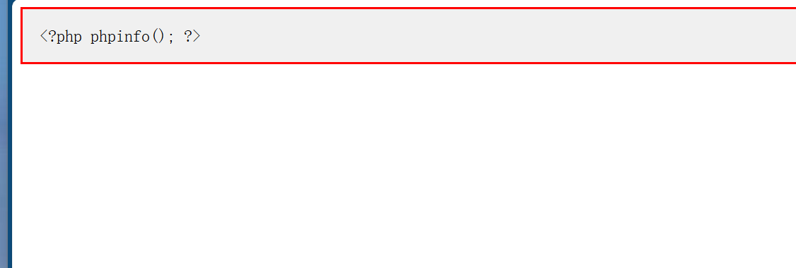

# File Upload Vulnerability Lab

一个基于 **Flask** 构建的文件上传靶场，用于演示 **文件上传漏洞** 的原理、利用过程以及如何通过 **白名单校验、文件重命名、存储路径隔离** 进行防御。

---

## 📌 项目结构

```
File-Upload-Lab/
├── app.py              # Flask 应用（存在漏洞的版本）
├── shell.php           # 用于验证漏洞的 Webshell 文件
├── screenshots/        # 复现过程截图
│   ├── 01-upload-success.png
│   └── 02-webshell-executed.png
├── uploads/            # 上传文件存储目录
└── README.md           # 项目说明文档
```

---

## 🛠 测试环境

| 项目     | 版本            |
| -------- | --------------- |
| 操作系统 | Windows 10 / 11 |
| Python   | 3.14+           |
| Flask    | 3.1.3           |
| 靶场地址 | http://127.0.0.1:5000 |

---

## 🚀 复现步骤

### 1. 启动靶场

在项目目录下执行：

```bash
python app.py
```

启动后访问 `http://127.0.0.1:5000`，你将看到一个文件上传页面。

### 2. 上传恶意文件

创建一个 Webshell 文件 `shell.php`，内容如下：

```php
<?php phpinfo(); ?>
```

通过页面的上传表单选择并上传该文件。上传成功后页面会提示文件保存路径，并提供「访问文件」链接。


### 3. 验证漏洞存在

访问 `http://127.0.0.1:5000/uploads/shell.php`，你将看到 PHP 配置信息页面（phpinfo），证明攻击者可以通过上传 Webshell 在服务器上执行任意代码。



> **注意**：查看 phpinfo 需要服务端配置了 PHP 解析环境。如果你没有 PHP 环境，依然可以通过 `http://127.0.0.1:5000/raw/shell.php` 查看文件源码，确认文件内容已成功上传。

---

## 🧬 漏洞成因

本示例存在以下安全缺陷：

| 缺陷                       | 说明                                                     |
| -------------------------- | -------------------------------------------------------- |
| **未限制文件类型**         | 服务器没有校验上传文件的后缀名或 MIME 类型，任意文件均可上传。 |
| **上传目录直接可访问**     | `uploads/` 目录暴露在 Web 根目录下，且可通过 `/uploads/` 路由被直接访问。 |
| **未对文件进行重命名**     | 文件以原始文件名存储，攻击者可以直接通过文件名访问恶意文件。 |

### 漏洞代码分析

在 `app.py` 中，关键问题出现在文件上传处理逻辑：

```python
# 没有任何文件类型校验
file = request.files['file']
if file and file.filename:
    filename = file.filename          # 使用原始文件名，未重命名
    filepath = os.path.join(app.config['UPLOAD_FOLDER'], filename)
    file.save(filepath)               # 直接保存到可访问目录
```

同时，`/uploads/` 路由不加区分地提供目录中的任意文件：

```python
@app.route('/uploads/<path:filename>')
def download_file(filename):
    return send_from_directory(app.config['UPLOAD_FOLDER'], filename)
```

---

## 🛡️ 防御方案

针对文件上传漏洞，以下是几种常见的防御措施。建议 **多层叠加使用**，仅靠单一措施无法完全杜绝风险。

### 1. 白名单校验文件类型

服务器仅允许上传指定扩展名的文件（如 `.jpg`、`.png`、`.pdf`）：

```python
ALLOWED_EXTENSIONS = {'png', 'jpg', 'jpeg', 'gif', 'pdf'}

def allowed_file(filename):
    return '.' in filename and filename.rsplit('.', 1)[1].lower() in ALLOWED_EXTENSIONS
```

### 2. 文件重命名

上传后对文件进行重命名（如使用 UUID），防止攻击者通过原始文件名直接访问：

```python
import uuid

filename = str(uuid.uuid4()) + os.path.splitext(file.filename)[1]
```

### 3. 存储路径隔离

将上传的文件存储在 Web 根目录之外，并通过专门的 API 提供访问，而不是直接暴露在 Web 目录下：

```python
# 将文件存储到 Web 根目录之外
UPLOAD_FOLDER = r'D:\secure_uploads'

# 通过路由读取文件，而不是直接暴露目录
@app.route('/files/<filename>')
def serve_file(filename):
    filepath = os.path.join(UPLOAD_FOLDER, filename)
    if os.path.exists(filepath):
        # 可以在此处增加权限校验
        return send_file(filepath)
    return 'File not found', 404
```

### 综合防御代码示例

```python
import os
import uuid
from flask import Flask, request, send_file, abort

app = Flask(__name__)
ALLOWED_EXTENSIONS = {'png', 'jpg', 'jpeg', 'gif', 'pdf'}
UPLOAD_FOLDER = r'D:\secure_uploads'

if not os.path.exists(UPLOAD_FOLDER):
    os.makedirs(UPLOAD_FOLDER)

def allowed_file(filename):
    return '.' in filename and \
        filename.rsplit('.', 1)[1].lower() in ALLOWED_EXTENSIONS

@app.route('/upload', methods=['POST'])
def upload():
    if 'file' not in request.files:
        return 'No file uploaded', 400

    file = request.files['file']
    if file.filename == '' or not allowed_file(file.filename):
        return 'File type not allowed', 400

    # 使用 UUID 重命名文件，保留原始扩展名
    ext = os.path.splitext(file.filename)[1]
    filename = str(uuid.uuid4()) + ext
    file.save(os.path.join(UPLOAD_FOLDER, filename))

    return f'Upload successful: {filename}'
```

---

## 📝 个人收获

- **理解了文件上传漏洞的本质**：服务器未对用户上传的文件进行充分的安全校验，攻击者可以利用这一缺陷上传恶意脚本并获取服务器控制权。
- **掌握了白名单校验和文件重命名的代码实现方式**：白名单校验能限制可上传的文件类型，文件重命名则可以防止攻击者预测或直接访问已上传的文件。
- **认识到防御必须多层叠加**：仅靠单一措施无法完全杜绝风险。白名单校验、文件重命名、存储路径隔离、文件内容检测等手段应组合使用，构建纵深防御体系。

---

## 🔗 参考链接

- [OWASP File Upload Cheat Sheet](https://cheatsheetseries.owasp.org/cheatsheets/File_Upload_Cheat_Sheet.html)
- [OWASP Unrestricted File Upload](https://owasp.org/www-community/vulnerabilities/Unrestricted_File_Upload)
